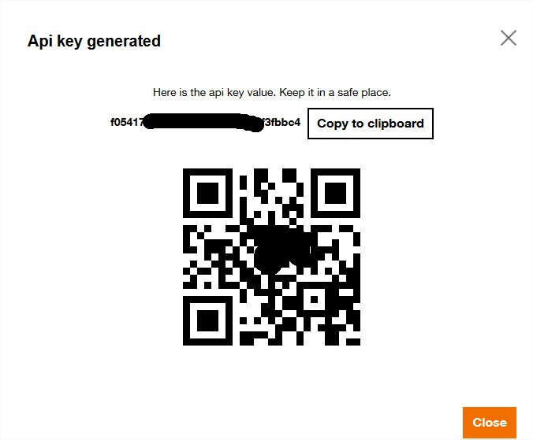
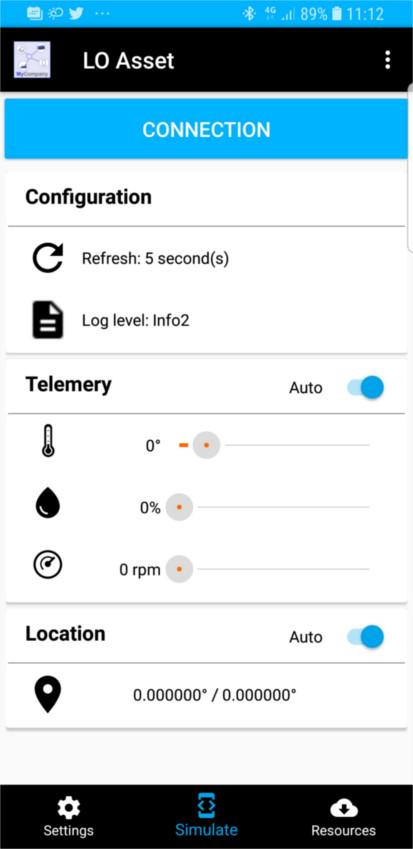
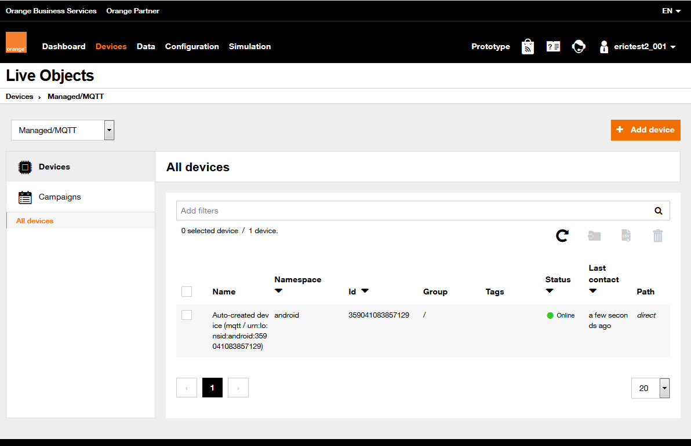
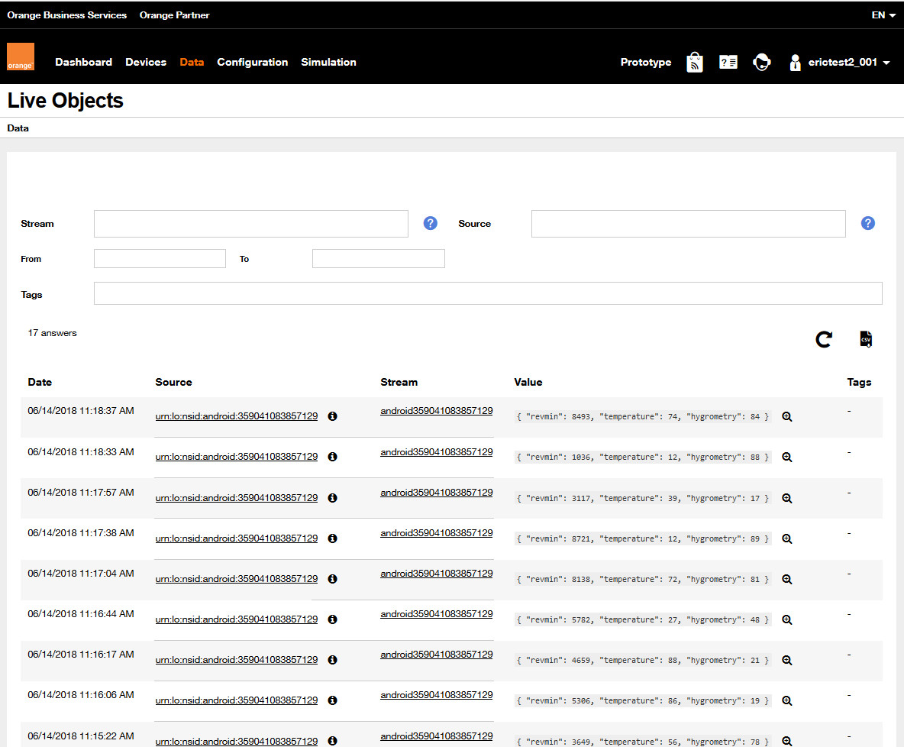

Copyright Orange - 2019 - Attribution-ShareAlike 3.0 Unported (CC BY-SA 3.0) - https://creativecommons.org/licenses/by-sa/3.0/

# Install software #
In order to be familiar with Tableau web data connectors and how to create one, please follow the Tableau tutorial :

[Tableau tutorial](http://tableau.github.io/webdataconnector/docs/)

and install the prerequisites (git, node, npm, the simulator tool).

Notice that you **need a Device Simulator** to test your web data connector and run your sample (html/JS file) in production in a web server.

If you have none, you can use our Android Device Simulator

# Android Device Simulator of Live Objects #

You can use the MQTT simulator Live Objects provides on Android phone.

First you can [download it on Google Play.](https://play.google.com/store/apps/details?id=com.orange.lo.assetdemo)

After installation you will find it under "LO Asset" name.

To use the simulator you need a Live Objects API key.

If you do not have a Live Objects account, you can get a 1 year free account on that page : https://liveobjects.orange-business.com/#/request_account

You can create an API Key in "Configuration" tab , then "Api keys" section.
Click on "Add an API key"

You have to enter 
* the Name of your key
* Its profile : for the simulator you select "MQTT device"
* then click on Create

You will get your API key. *Important : you have to keep it, Live Objects won't display it again if you lose it.*

You can use the camera of your phone to scan the QR code to easily enter the key.

On the simulator go on "Simulate" tab and click on "Connection"

Your simulator begins sending data on Live Objects.

In "Device" tab, we can check if your simulator is connected seeing its green status : 

In "Data" tab, you can see incoming data from the simulator. Note the payload format in JSON. 

## Now you are ready ! ##
