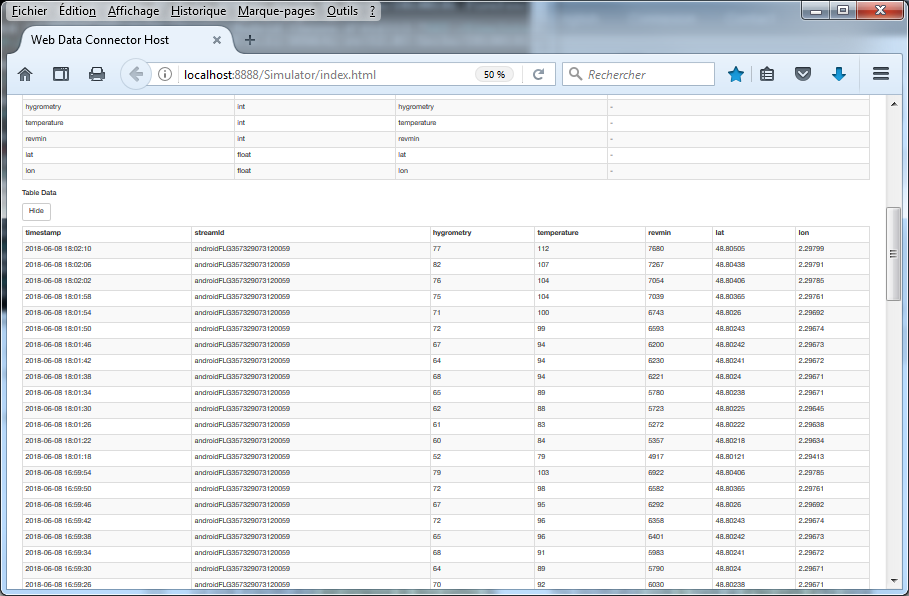
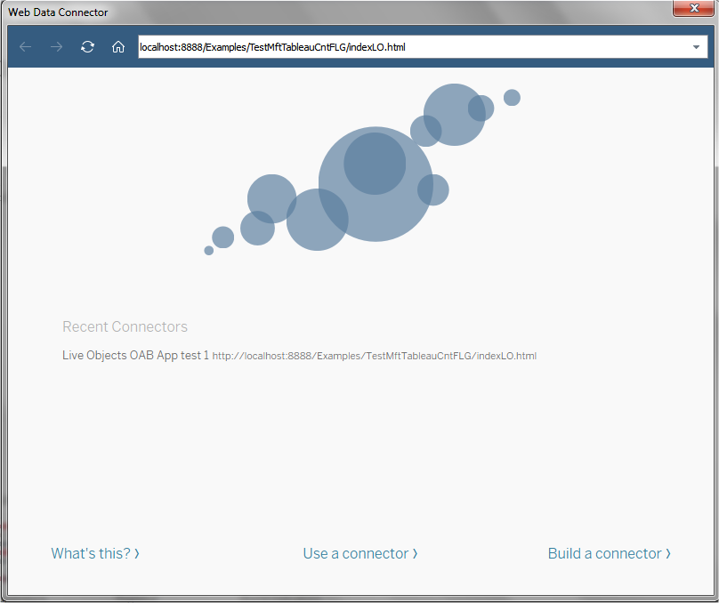
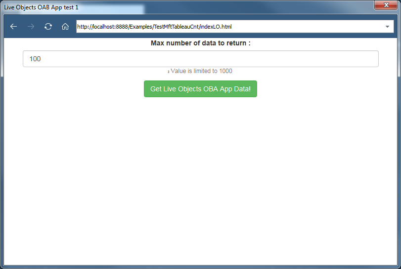
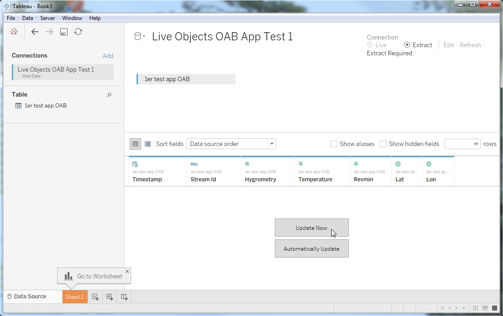
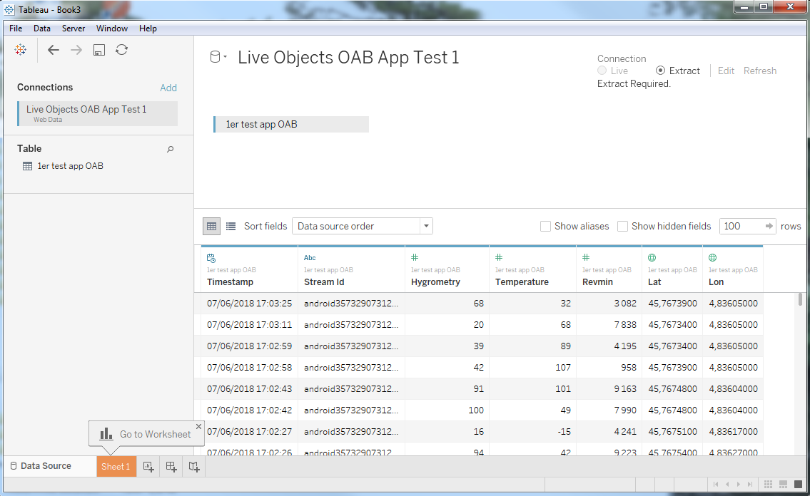

# Test the web data connector with the simulator #

Start the web server : 
*	open a command prompt with administrator rights and go into the “webdataconnector” directory.
* run **“npm start”** to launch the server.
 
 
 
Open a browser and launch the WDC simulator with the following url: 

```ruby
http://localhost:8888/Simulator/index.html
```

In the WDC URL field, enter the path to the WDC relative to the simulator. In this example, we have put the indexLO.html and MongoCnt.js files into “Examples/TestMftTableauCntFLG”.

 

Click the Start Interactive Phase button. The connector page appears in a new window.
 
 
 
Enter the number of values to be inserted and click on the “Get Live Objects OAB App Data!”. You will see the columns that will be inserted to Tableau. 

 
 
Then click on “Fetch Table Data”, the values to be inserted will appear.
 
 

## Use the web data connector with Tableau Desktop ##
Open Tableau Desktop. on the first screen, you find in "To a server" section a "More..." section, click on it.
Then choose and select the “Web Data Connector” entry. 

Your files (html and java scripts) **must** be into the WDC directory.
In the WDC URL field, enter the path of your indexLO.html file. The path must be relative to the WDC directory. For example, if you have created them into 

__“webdataconnector/Examples/TestMftTableauCntFLG”__

, you might enter: 

```ruby
localhost:8888/Examples/TestMftTableauCntFLG/indexLO.html
```

 

 

Then enter the number of data to get (max 1000 in this sample).

 

Tableau will display the columns to be filled. Then click on “Update Now”.

 

Tableau will load your data through Live Objects API.
 
 

You can then view and analyze your data. 

In order to get the same dashboard, **you can open the LoDash2.twb file in Tableau Desktop**. 
Do not forget your own data from your data connector (overwise you will read the demo data included in the file).
 
 

 
