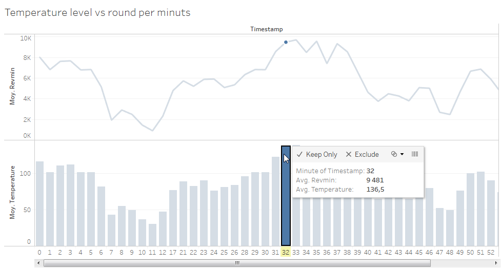
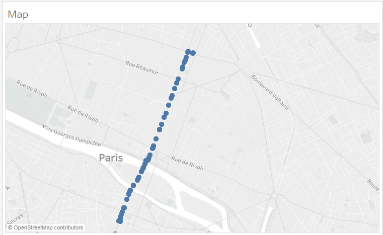

# Connecting Tableau and Live Objects

This tutorial will show you how to visualize and analyze your Live Objects IoT data with Tableau, one of the most powerful BI tools.

Creating a web data connector (WDC) is the best way to make a quick integration between Live Objects and Tableau.
In this tutorial we will show you how to: 
*	generate data through Live Objects with an Android simulator
*	install the needed tools
*	adapt the Tableau web data connector template with Live Objects and the Android simulator data model
*	use the web data connector with Tableau Desktop
