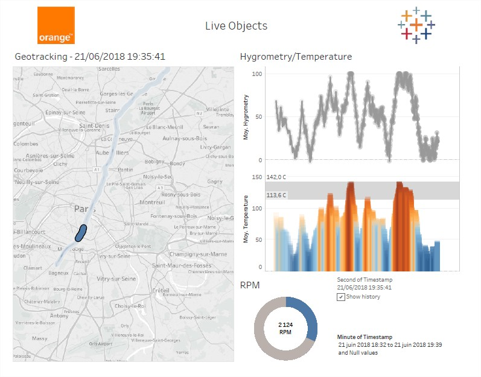

Copyright Orange - 2019 - Attribution-ShareAlike 3.0 Unported (CC BY-SA 3.0) - https://creativecommons.org/licenses/by-sa/3.0/

# Connecting Tableau and Live Objects

This tutorial will show you how to visualize and analyze your Live Objects IoT data with Tableau, one of the most powerful BI tools.

Creating a web data connector (WDC) is the best way to make a quick integration between Live Objects and Tableau.
In this tutorial we will show you how to: 
*	generate data through Live Objects with an Android simulator
*	install the needed tools
*	adapt the Tableau web data connector template with Live Objects and the Android simulator data model
*	use the web data connector with Tableau Desktop

If you want to have a quick preview of the result of this tutorial:
*	install the **free trial version** of Tableau Desktop at https://www.tableau.com/products/trial
*	download [LoDash2.twbx](https://github.com/DatavenueLiveObjects/tableau-getting-started/blob/master/LoDash2.twbx) in this Git and open it with Tableau
